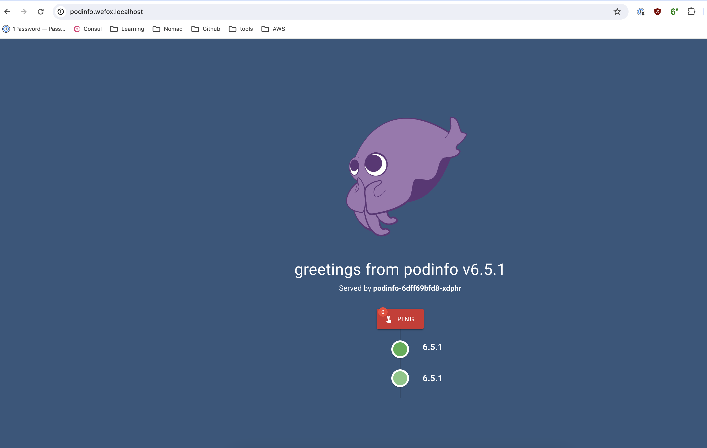
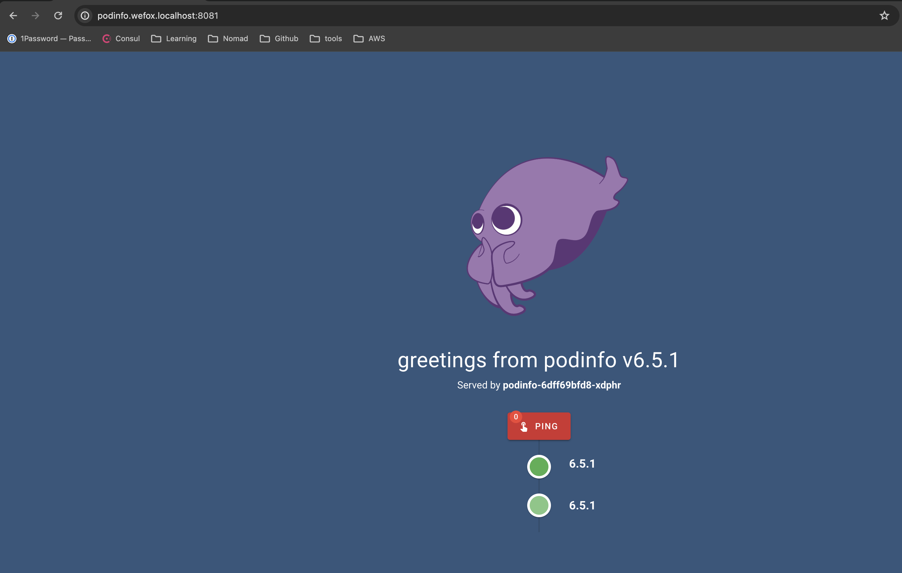
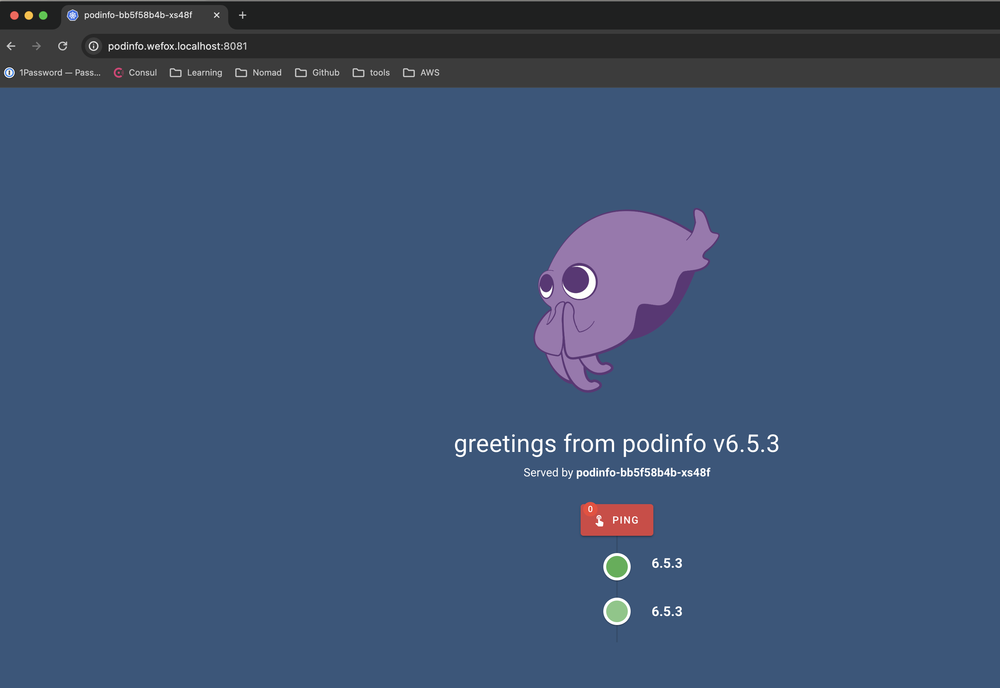

# Deployment of Kubernetes Manifests

To deploy your Kubernetes manifests, follow these steps:

# Create Namespace:
Check the current namespaces in your cluster

``` kubectl get ns ```
If needed, create a new namespace:
```kubectl create ns application ```

# Deploy Resources:
Navigate to the main folder (e.g., kubernetes) and deploy your resources (Deployment and Service) in the application namespace:

``` cd k8s && \
kubectl apply -f deployment.yaml -n application && \
kubectl apply -f service.yaml -n application ```


# Verify Deployment logs:
 ``` kubectl logs pod/pod-name -n application```

 

# Ingress Setup
## Deploy Nginx controller in the cluster 
``` kubectl apply --filename https://raw.githubusercontent.com/kubernetes/ingress-nginx/master/deploy/static/provider/kind/deploy.yaml ```

For more details, refer to Ingress Nginx Deployment Documentation.
This command will create a separate namespace named ingress-nginx. Verify the namespace again:
``` kubectl get ns ```

# Apply Ingress: 
``` kubectl apply -f ingress.yaml -n application ```

 ### Verify 

``` curl http:///podinfo.wefox.localhost:80```


### Wait for a while and reload the browser
### Open http:///podinfo.wefox.localhost:80 in a browser

 

# Port Forwarding:
``` kubectl port-forward --namespace=ingress-nginx service/ingress-nginx-controller 8081:80 ```

# Update Deployemnt

``` kubectl set image deployment/podinfo podinfo=stefanprodan/podinfo:6.5.3 --record=true -n application
kubectl rollout history deployment/podinfo -n application
kubectl rollout history deployment/podinfo --revision=2 -n application ```


### Wait for a while and reload 
``` http://podinfo.wefox.localhost:8081/ ```

