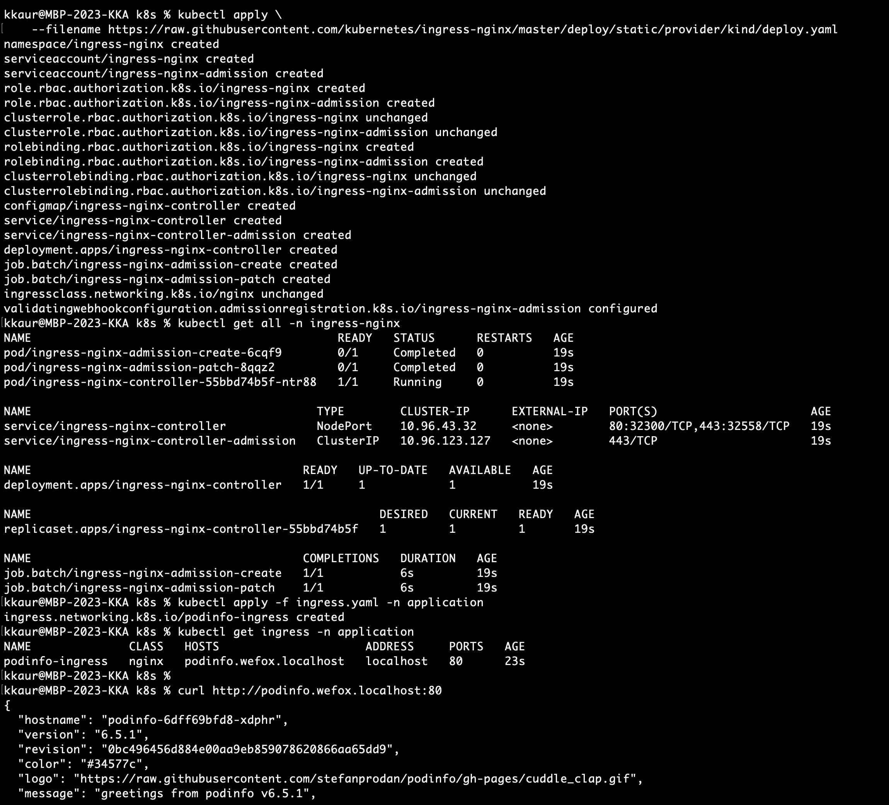
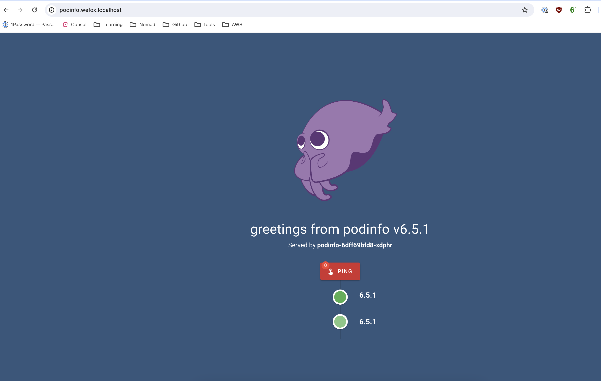
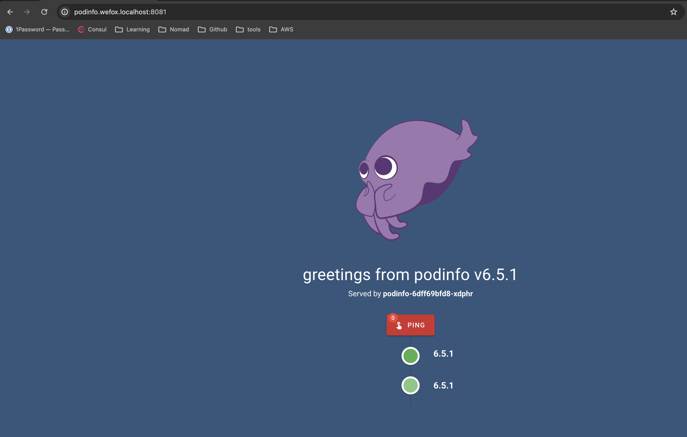
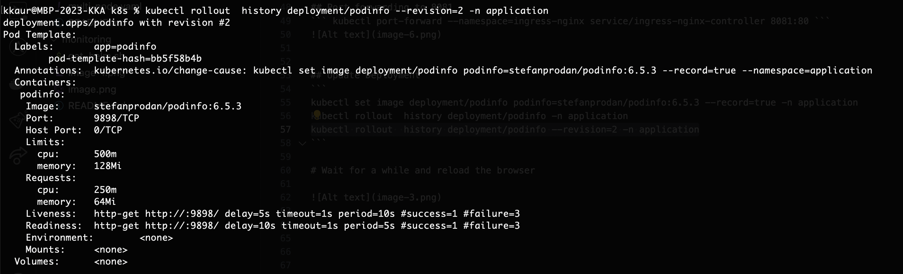
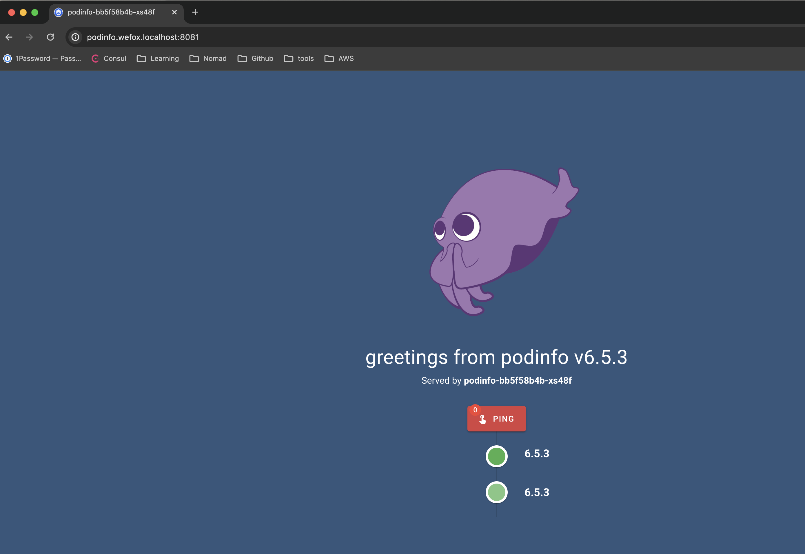

# Deployment of Kubernetes manifests

``` kubectl get ns ``` -- to check current namespaces
## Create separate namespace in cluster

``` kubectl create ns application ```

Then deploy everything here in this namespace - Deployment, Service and Ingress 
Make sure you are inside main folder- kubernetes 

``` 
cd k8s
kubectl apply -f deployment.yaml -n application
kubectl apply -f service.yaml -n application ```

### Verify logs 
``` kubectl apply -f deployment.yaml -n application ```


Deployment is working fine for version 6.5.1

## Ingress 

## Deploy nginx-controller in cluster
kubectl apply \
    --filename https://raw.githubusercontent.com/kubernetes/ingress-nginx/master/deploy/static/provider/kind/deploy.yaml

For more details[here](https://kubernetes.github.io/ingress-nginx/deploy/)

It will  create separate namespace "ingress-nginx" 
Verify namespace again :
``` kubectl get ns ```

``` kubectl apply -f ingress.yaml -n application```

``` curl http:///podinfo.wefox.localhost:80```



# Wait for a while and reload the browser
# Open http:///podinfo.wefox.localhost:80 in a browser


Deployment version 6.5.1 is deployed on port 80

## Port forwarding to 8081
``` kubectl port-forward --namespace=ingress-nginx service/ingress-nginx-controller 8081:80 ```



## Update Deployment
```
kubectl set image deployment/podinfo podinfo=stefanprodan/podinfo:6.5.3 --record=true -n application
kubectl rollout  history deployment/podinfo -n application
kubectl rollout  history deployment/podinfo --revision=2 -n application
```



# Wait for a while and reload the browser 



``` http://podinfo.wefox.localhost:8081/```


## Deployment.yaml
This file contains the configuration about the application deployment, image name, version to be deployed 
```
kubectl apply -f deployment.yaml
```
## service.yaml

