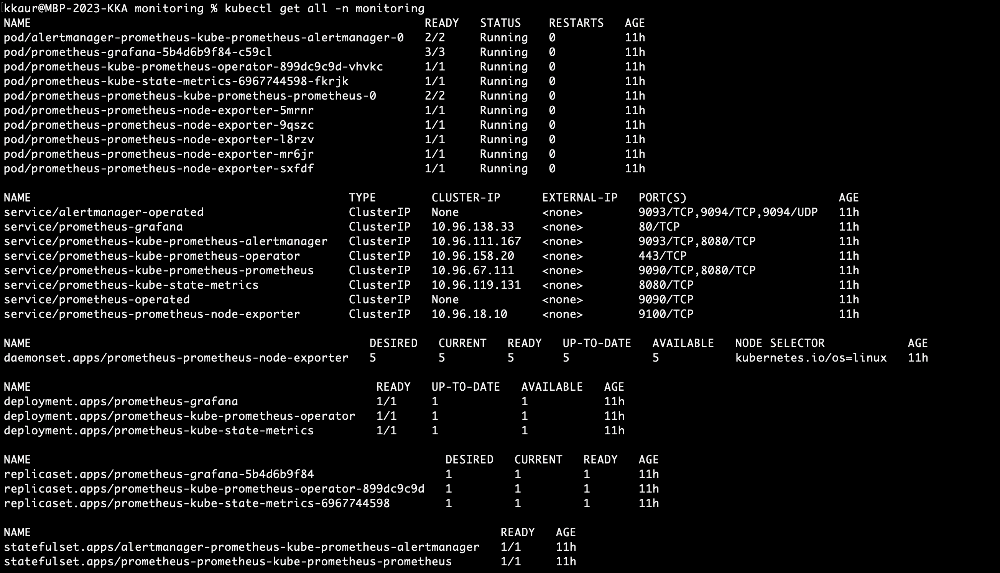
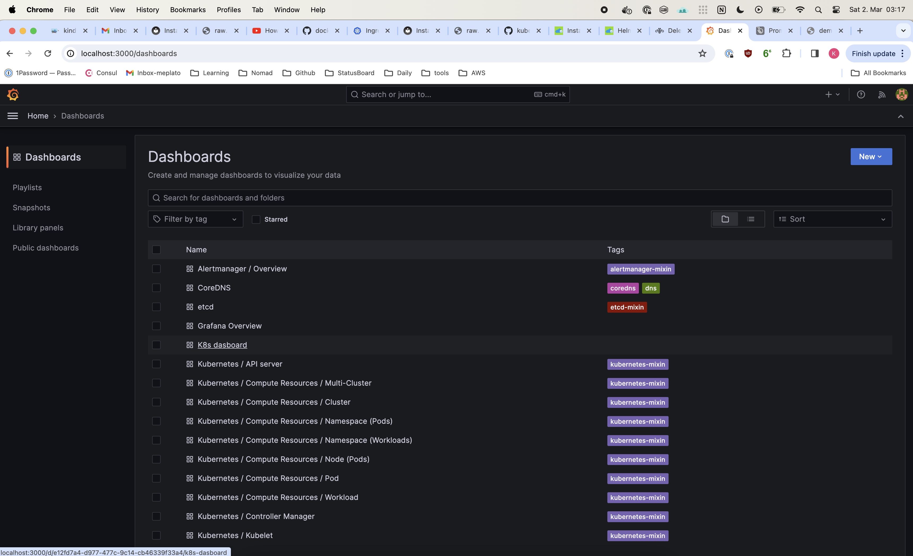
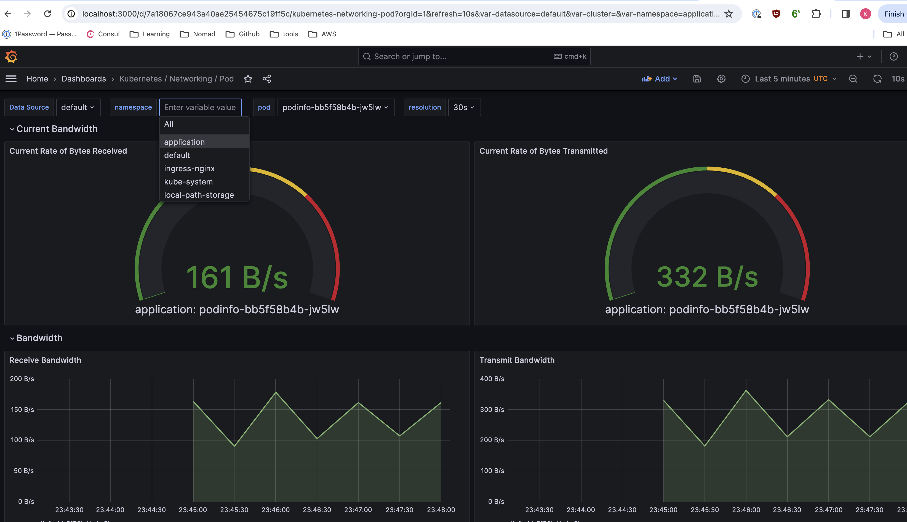
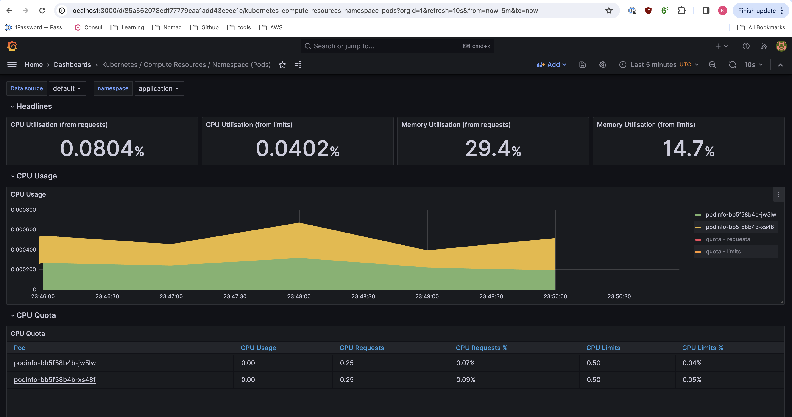
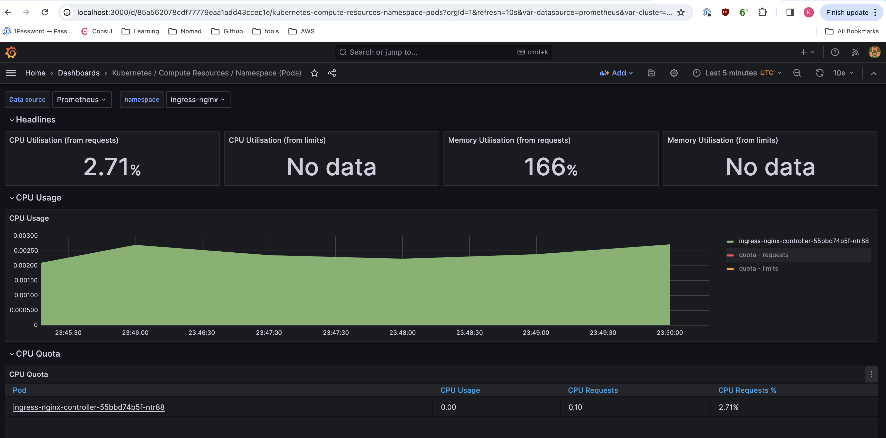
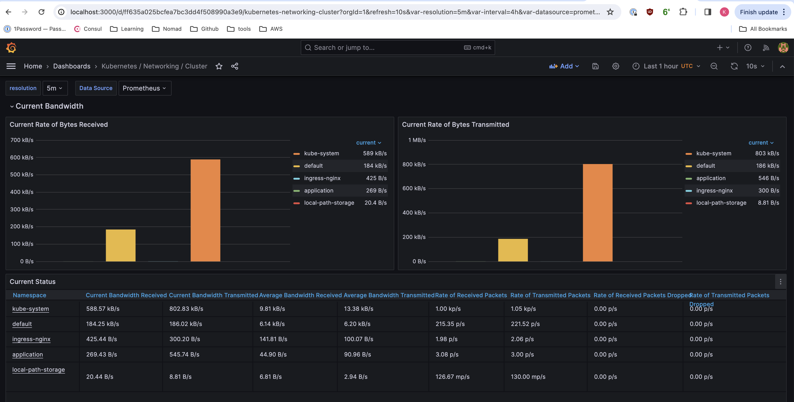
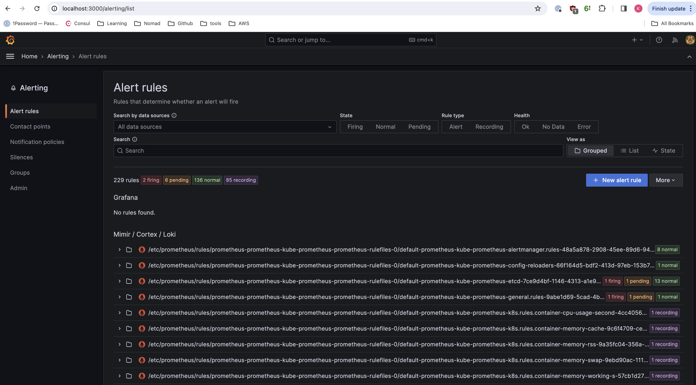
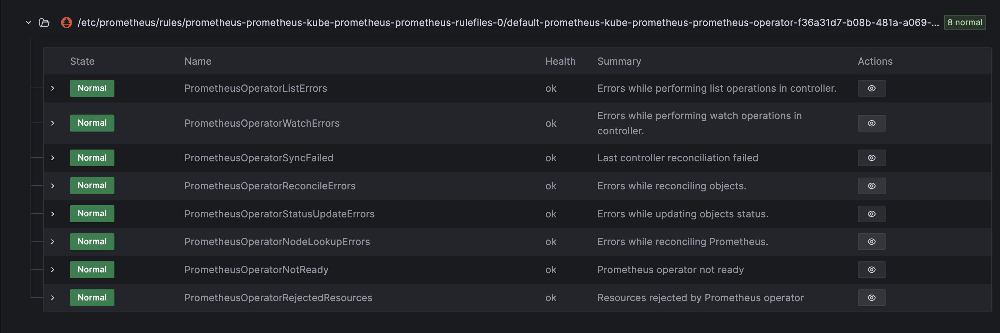

# Kubernetes Cluster Monitoring with Prometheus-Grafana

For the first time, create a new namespace as below:

```
kubectl create ns monitoring
```

### Step 1: Install Helm charts on cluster
For more details please read [here](https://k21academy.com/docker-kubernetes/prometheus-grafana-monitoring/)

```
curl -fsSL -o get_helm.sh https://raw.githubusercontent.com/helm/helm/main/scripts/get-helm-3
chmod 700 get_helm.sh
./get_helm.sh

```

### Step 2: Install Prometheus/grafana charts 
```
helm repo add prometheus-community https://prometheus-community.github.io/helm-charts
helm repo add stable https://charts.helm.sh/stable  
helm repo update

```

### Step3: Install Prometheus Kubernetes 
```
helm install prometheus prometheus-community/kube-prometheus-stack -n monitoring

```



### Step 4: Kubernetes Prometheus Port Forward, Login to grafana
```
kubectl port-forward deployment/prometheus-grafana 3000
```
**Inital User/Password**
```
username: admin
password: prom-operator
```

If needed, one needs to add Prometheus as a data source. 
Go to "Configuration" > "Data Sources" > "Add data source". Select Prometheus and provide the URL of your Prometheus instance (e.g., http://prometheus-server:9090) 
```
Grafana is up and running on localhost:3000
```



#### Pod Metrics 



#### Namespace Metrics


#### Cluster Health


#### Alert Rules 



